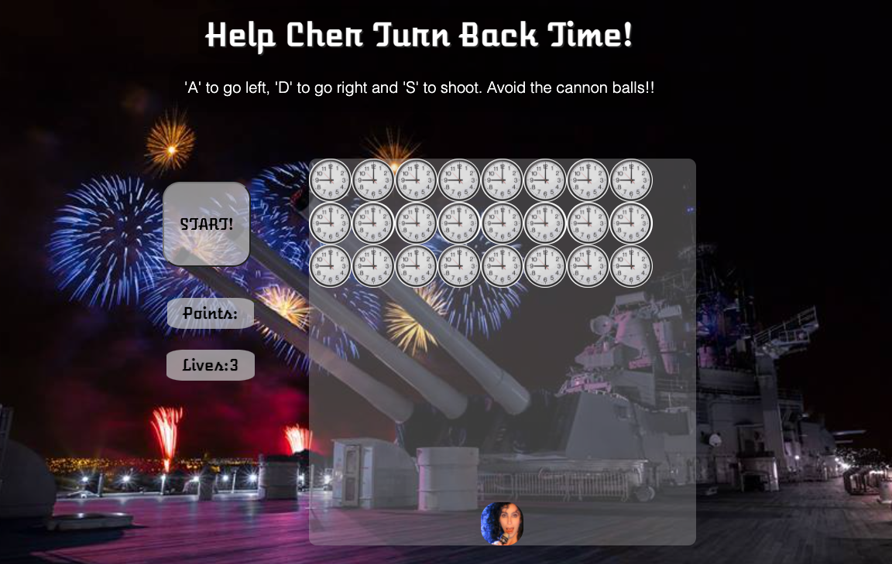
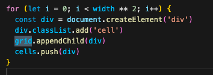

# Project-one

### Play the game [here](https://selliott456.github.io/Project-one/).

This was an individual project that took one week to build and was suggested to be of a mid-level difficulty from my course provider (General Assembly). 

##Brief 

* Render a game in the browser
* Design logic for winning & visually display which player won
* Include separate HTML / CSS / JavaScript files
* Use **Javascript** for DOM manipulation
* Deploy your game online, where the rest of the world can access it
* Use semantic markup for HTML and CSS (adhere to best practices)

####Requirements

* The player should be able to clear at least one wave of aliens
* The player's score should be displayed at the end of the game

##Tech Stack

* HTML
* CSS
* JavaScript

###The Build

The basic elements of creating this game, were as follows: 

### 1 - Set out a grid
A grid was achieved by using a simple for loop and DOM manipulation. Grid was a pre-assigned const in the JS file, representing a div with the class "grid" in the index.html file. 

### 2 - Be able to move your shooter left and right within the grid
### 3 - Move the bullets/bombs 
### 4 - Move the indvaders
