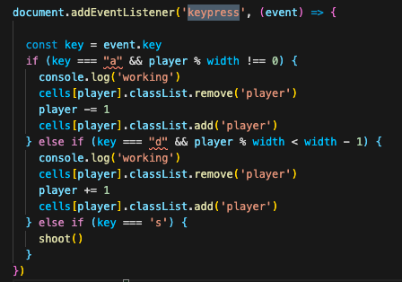
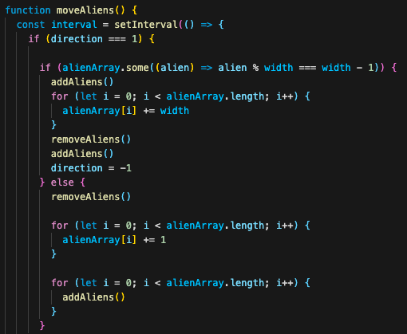

# Project-one

### Play the game [here](https://selliott456.github.io/Project-one/).

This was an individual project that took one week to build and was suggested to be of a mid-level difficulty from my course provider (General Assembly). 

##Brief 

* Render a game in the browser
* Design logic for winning & visually display which player won
* Include separate HTML / CSS / JavaScript files
* Use **Javascript** for DOM manipulation
* Deploy your game online, where the rest of the world can access it
* Use semantic markup for HTML and CSS (adhere to best practices)

####Requirements

* The player should be able to clear at least one wave of aliens
* The player's score should be displayed at the end of the game

##Tech Stack

* HTML
* CSS
* JavaScript

###The Build

The basic elements of creating this game, were as follows: 

### 1 - Set out a grid
A grid was achieved by using a simple for loop and DOM manipulation. Grid was a pre-assigned const in the JS file, representing a div with the class "grid" in the index.html file. 

### 2 - Be able to move your shooter left and right within the grid
The player is assigned the middle number of the bottom row of my grid. In this instance let player = 76.
The width of the gird s then used to limit the movement of the player left and right. The movement of the player was controlled with the eventListener "keypress". 

### 3 - Move the bullets/bombs 
the movement of the bombs and the player missiles were achieved in much the same way. The main difference being that the origin of a bomb was generated using a random number from any of the tiles the aliens happened to be on. Both were created using the width of the grid (either adding or subtracting one width depending on direction of travel. The class of bullet/bomb was then repeatedly removed and added until it hit the edge of the grid or another class such as player/alien. 

### 4 - Move the invaders
I found this exceptionally challenging. Initially I tried to attack it using a for loop but ended up creating some weird effects. The easiest way from me to fix the problem was to make separate functions to add and remove aliens, while changing the direction. rows were skipped by adding grid width the the index.js were the aliens were. I'm sure there is a nicer way to do this, but I was concerned I would not have an MVP in time for launch so I used this as it works and styled to project a little before deployment. 

### Bugs/Code issues
from time to time, a random cannonball is left at the bottom of the grid for a moment after the game is finished. I think this is an issue with clearing an interval in the right area that I've failed to spot. That said, initially I was taking the new-comer approach and sometimes putting clearIntervals in places just to "see what happened". As such - there may be one or two still floating about that I never spotted when I was refactoring my code. 

### conclusion
I made this within 3 weeks of writing my first line of code in JS so I'm really proud of it in spite of its little issues. I also think it represents my sense of humour to be hailing an iconic 80's moment in the history of a one-word diva during a coding class. I hope you enjoy playing it!

